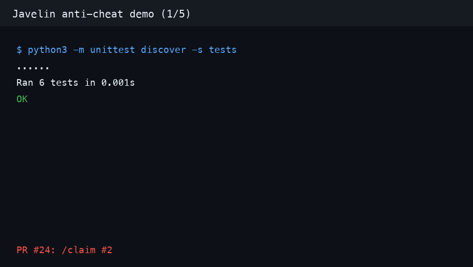

# py-workedtask

Baseline anti-cheat guards for the Javelin project.



## Coverage

- C++ client (`AntiCheat.cpp`)
  - detects an attached Windows debugger
  - scans the process list for common cheat/debugging tools
  - keeps the optional CRC32 integrity hook buildable
- Python monitor (`anti_cheat.py`)
  - detects Python tracing/debugging
  - scans `tasklist` output on Windows for common cheat/debugging tools
  - exposes small testable functions for CI coverage

## C++ usage

Build on Windows with a C++17 compiler:

```powershell
cl /std:c++17 /EHsc AntiCheat.cpp
.\AntiCheat.exe
```

To enable the optional integrity check, pass the expected CRC32 at build time:

```powershell
cl /std:c++17 /EHsc /DJAVELIN_EXPECTED_CRC32=0x12345678 AntiCheat.cpp
```

## Python usage

Run the monitor directly:

```bash
python anti_cheat.py --verbose
```

Run the regression tests:

```bash
python -m unittest discover -s tests
```
